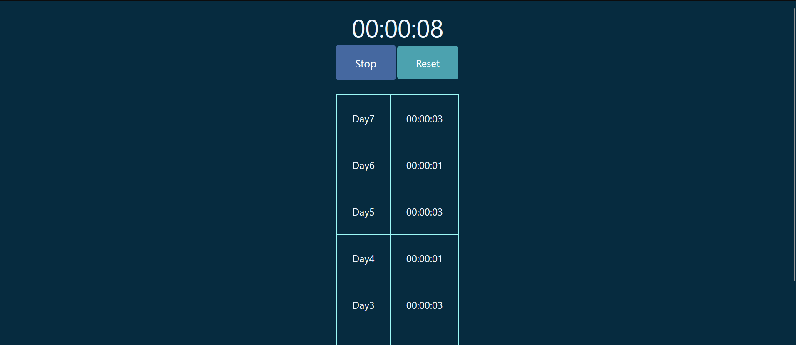

### Tracks how much time I have spent studying daily.
`Since this is javascript history needs to be stored manually in saved_time = {}, daily. At the beginning of the day press reset, copy the history from` **console.log** `and paste it manually`. **Node.js** `should fix this manual work.`

